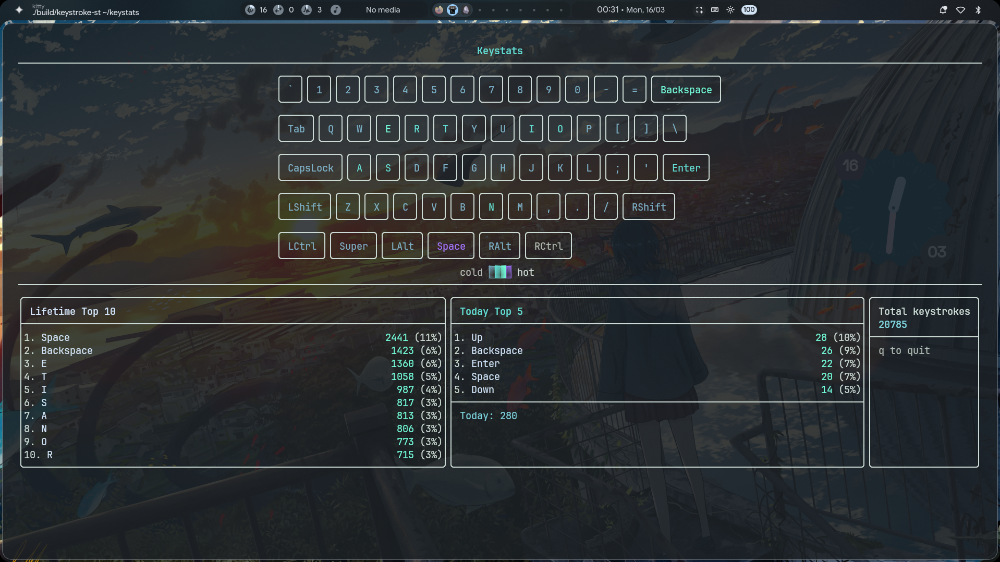

# keystats

per-key keystroke counter that stores lifetime stats in SQLite and renders a live terminal heatmap with FTXUI




---

## Architecture

keystats is split into two binaries that communicate through a shared SQLite database:
```
keyboard input
    └── /dev/input/eventX  (Linux evdev)
            └── keystroke  (daemon)
                    └── ~/.keystroke_counts.db  (SQLite)
                            └── keystroke-stats  (viewer)
                                    └── terminal heatmap  (FTXUI)
```

**Daemon (`keystroke`)** runs silently as a systemd user service. It reads raw keyboard events directly from `/dev/input/` using Linux's evdev interface — the same layer the kernel uses to handle input devices. Every keydown event increments that key's count in memory and flushes it to a local SQLite database. No key sequences are ever stored — only counts.

**Viewer (`keystroke-stats`)** is a separate binary ran manually. It reads the SQLite database, renders a live color-coded keyboard heatmap using FTXUI, and refreshes every 200ms.

---

## Dependencies

**Arch**
```bash
sudo pacman -S gcc cmake sqlite
```

**Ubuntu / Debian**
```bash
sudo apt install g++ cmake libsqlite3-dev
```

**Fedora**
```bash
sudo dnf install gcc cmake sqlite-devel
```

> FTXUI is fetched automatically by CMake during build using FetchContent() — no manual installation needed.

---

## Install
```bash
git clone https://github.com/Manoj-HV30/keystats
cd keystats
make
sudo make install
```

Then enable and start the daemon:
```bash
systemctl --user enable keystats
systemctl --user start keystats
```

> You will need to log out and back in after install for input group permissions to take effect.

---

## Usage
```bash
keystroke-stats
```

Press `q` to quit.

---

## Data

Your keystroke database is stored at `~/.keystroke_counts.db` locally. It never leaves your machine. Also only key counts are stored — not sequences, not context, not timing.

---

## Uninstall
```bash
sudo make uninstall
```

---

## References

- [Linux Input Subsystem](https://www.kernel.org/doc/html/latest/input/input.html)
- [SQLite C API](https://www.sqlite.org/cintro.html)
- [SQLite Tutorial](https://www.sqlitetutorial.net)
- [FTXUI](https://github.com/ArthurSonzogni/FTXUI)
- [systemd.service](https://www.freedesktop.org/software/systemd/man/systemd.service.html)

---

## License

MIT
